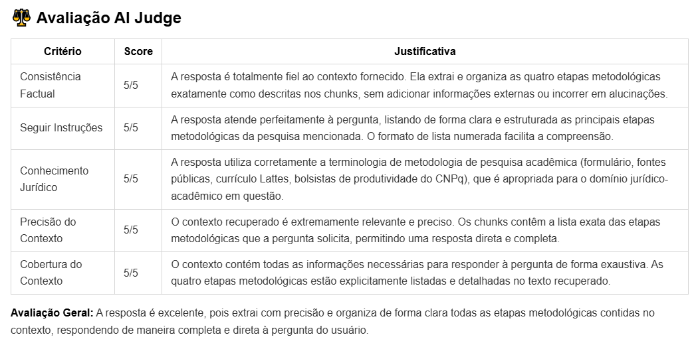

# 📊 Sistema de Avaliação Comparativa RAG

## 🎯 Objetivo

Este sistema permite avaliar e comparar a qualidade de dois sistemas RAG de forma interativa e individualizada:
1.  **RAG Manual:** Implementação customizada com ChromaDB + SentenceTransformer.
2.  **File Search RAG:** Solução gerenciada do Google Gemini.

O design atual foca no script `evaluate_light.py`, que é ideal para execuções controladas, especialmente ao usar APIs com limites de requisição (como a API gratuita do Gemini).

## 📁 Arquivos do Sistema

```
01RAG/
├── evaluate_light.py           # ✅ Script principal para avaliação interativa
├── ai_judge.py                 # ✅ NOVO: Módulo AI Judge com LiteLLM (agnóstico)
├── test_litellm_providers.py   # ✅ NOVO: Teste isolado de provedores
├── file_search_rag.py          # Implementação do File Search RAG
├── retriever.py                # Componentes do RAG Manual
├── augmentation.py             # ...
├── generation.py               # ...
├── test_config.json            # Configuração das perguntas de teste
├── console_presenter.py        # Módulo para apresentação no console
├── report_generator.py         # Módulo para salvar relatórios
├── .env.example                # Template de variáveis de ambiente
├── README.md                   # Este arquivo
└── evaluation_results/         # 📂 Diretório onde os resultados são salvos
```

## 🚀 Como Usar

Siga os passos abaixo para configurar e executar o sistema de avaliação.

### Pré-requisitos
*   Python 3.12+
*   `uv` (ou `pip`) instalado

### Passo 1. Clone o Repositório
```bash
git clone https://github.com/matheus896/evaluate-rag.git
```

### Passo 2: Configurar Variáveis de Ambiente

Crie um arquivo `.env` na raiz do diretório a partir do exemplo fornecido.

```bash
# Crie o arquivo .env
cp .env.example .env
```
Agora, edite o arquivo `.env` e adicione sua chave de API do Google Gemini:

```env
GOOGLE_API_KEY="SUA_CHAVE_DE_API_AQUI"
```

### Passo 3: Instalar as Dependências

É recomendado usar `uv` para uma instalação mais rápida e gerenciamento de ambiente.

```bash
# Crie um ambiente virtual
uv venv 

# Ative o ambiente
# No Windows:
.venv\Scripts\activate
# No macOS/Linux:
source .venv/bin/activate

# Instale as dependências do pyproject.toml
uv sync
```
### Passo 4. Popule as Bases de Conhecimento (ChromaDB):

Este é o passo crucial de **Indexação**. Vamos executar o script que lê os documentos, os divide em *chunks*, gera os *embeddings* e os armazena no ChromaDB.
```bash
# Execute o script para criar as bases de dados vetoriais
python semantic_encoder.py
```
*   Este script irá criar uma pasta `chroma_db` e populará as coleções `synthetic_dataset_papers` e `direito_constitucional`, que são usadas.

### Passo 5: Configurar Perguntas de Teste (Opcional)

Você pode adicionar ou modificar as perguntas de avaliação editando o arquivo `test_config.json`. A estrutura é autoexplicativa.

### Passo 6: Executar a Avaliação Interativa

Execute o script `evaluate_light.py` para iniciar a interface de linha de comando.

```bash
python evaluate_light.py
```

Você verá um menu de opções:

```
📋 OPÇÕES:
  [L] Listar todas as perguntas disponíveis
  [1-10] Avaliar pergunta específica (com AI Judge)
  [Q] Avaliar pergunta SEM AI Judge (apenas respostas)
  [S] Sair

👉 Escolha uma opção:
```

-   **`L`**: Mostra a lista de todas as perguntas carregadas do `test_config.json`.
-   **`1-10`**: Digite o número da pergunta para executar a avaliação completa, incluindo a análise de qualidade pelo "AI Judge" (configurável via LiteLLM - padrão: Cerebras).
-   **`Q`**: Permite testar a recuperação e geração de respostas de ambos os sistemas RAG sem invocar o AI Judge. É mais rápido e não consome chamadas extras à API.
-   **`S`**: Encerra o programa.

### Passo 7: Analisar os Resultados

Para cada pergunta avaliada, o sistema gera automaticamente dois arquivos no diretório `evaluation_results/`:

1.  **`evaluation_single_q<ID>_<timestamp>.json`**: Contém todos os dados brutos da avaliação, incluindo respostas, chunks, latência e scores.
2.  **`evaluation_single_q<ID>_<timestamp>.md`**: Um relatório em Markdown, formatado para fácil leitura, com a comparação lado a lado dos dois sistemas.

## 🔄 Usando LiteLLM para Alterar o AI Judge

A partir da versão atual, o sistema de avaliação utiliza **LiteLLM** para desacoplar o AI Judge de um único provedor. Isso significa que você pode facilmente trocar entre diferentes provedores de LLM (Cerebras, OpenAI, Anthropic, etc.) sem alterar o código principal.

### Passo 1: Testar o Provedor Isoladamente

Antes de integrar um novo provedor ao sistema de avaliação, teste-o de forma isolada usando o script `test_litellm_providers.py`:

```bash
python test_litellm_providers.py
```

### Passo 2: Configurar o Provedor (test_litellm_providers.py)

Edite o arquivo `test_litellm_providers.py` e altere as linhas de configuração do provedor:

**Linha 44** - Altere o `"model"` para o modelo de sua escolha:
```python
"model": "cerebras/gpt-oss-120b",  # Exemplo com Cerebras
```

Para encontrar o formato correto do seu modelo desejado, consulte a documentação oficial:
👉 **https://docs.litellm.ai/docs/providers**

Exemplos de formatos válidos:
- **Cerebras**: `"cerebras/gpt-oss-120b"` ou `"cerebras/llama-3.3-70b"`
- **OpenAI**: `"openai/gpt-4o"` ou `"openai/gpt-4-turbo"`
- **Anthropic**: `"anthropic/claude-3-sonnet-20240229"`
- **Google Gemini**: `"vertex_ai/gemini-2.5-pro"`

**Linha 45** - Altere a `"api_key_env"` para a variável de ambiente que você definiu no seu `.env`:
```python
"api_key_env": "CEREBRAS_API_KEY",  # Exemplo para Cerebras
```

Se você definiu no seu `.env`:
```env
# Exemplos
CEREBRAS_API_KEY="sua-chave-aqui"
OPENAI_API_KEY="sua-chave-aqui"
ANTHROPIC_API_KEY="sua-chave-aqui"
GOOGLE_API_KEY="sua-chave-aqui"
```

### Passo 3: Executar o Teste

```bash
python test_litellm_providers.py
```

### O Que o Teste Mostra

O script `test_litellm_providers.py` executa três validações para seu provedor:

| Teste | O Que Valida | Esperado |
|-------|-------------|----------|
| **Teste Básico** | Conectividade e resposta simples | ✅ Resposta "OK" em poucos segundos |
| **Teste JSON Mode** | Resposta estruturada em JSON (crítico para o AI Judge) | ✅ JSON válido parseado corretamente |
| **Teste Streaming** | Streaming de respostas (opcional, não bloqueante) | ✅ Chunks recebidos sequencialmente |

**Exemplo de saída bem-sucedida:**
```
================================================================================
📊 RESUMO DE TESTES: PROVIDER
================================================================================

✅ Passaram: 2/2
❌ Falharam: 0/2
⊘ Pulados: 0/2

✅ BASIC: success
✅ JSON_MODE: success

✅ TODOS OS TESTES PASSARAM!

🎉 O provedor está pronto para integração com o AI Judge.
```

### Passo 4: Configurar no test_config.json

Após o teste passar com sucesso, edite o arquivo `test_config.json` e altere a linha do `ai_judge_model`:

**Linha 88** - Altere para o seu provedor:
```json
"ai_judge_model": "cerebras/gpt-oss-120b",
"ai_judge_temperature": 0.1
```

### Passo 5: Executar a Avaliação com o Novo Provedor

```bash
python evaluate_light.py
```

Escolha uma pergunta para avaliar (por exemplo, digite `1` para avaliar a pergunta 1).

O sistema agora usará seu provedor configurado via LiteLLM para realizar as avaliações do AI Judge.

### Exemplo Completo: Migrando para OpenAI

Se você quiser usar OpenAI em vez de Cerebras, siga este exemplo:

**1. Configure seu `.env`:**
```env
GOOGLE_API_KEY="sua-chave-gemini"
OPENAI_API_KEY="sk-sua-chave-openai"
```

**2. Edite `test_litellm_providers.py` (linhas 44-45):**
```python
"model": "openai/gpt-4o",
"api_key_env": "OPENAI_API_KEY",
```

**3. Execute o teste:**
```bash
python test_litellm_providers.py
```

**4. Se passar, edite `test_config.json` (linha 88):**
```json
"ai_judge_model": "openai/gpt-4o",
```

**5. Execute a avaliação:**
```bash
python evaluate_light.py
```

---

## 📋 Critérios de Avaliação

O sistema avalia **5 critérios** usando um "AI Judge" (configurável via LiteLLM):

| Critério | Peso | Descrição |
|---|---|---|
| **Consistência Factual** | 25% | A resposta está baseada no contexto? Sem alucinações? |
| **Seguir Instruções** | 15% | A resposta segue o formato solicitado? |
| **Conhecimento do Domínio** | 20% | Usa terminologia jurídica corretamente? |
| **Precisão do Contexto** | 20% | Os chunks recuperados são relevantes? |
| **Cobertura do Contexto** | 20% | O contexto contém toda informação necessária? |

### Escala de Pontuação (1-5)

-   **5:** Excelente
-   **4:** Muito Bom
-   **3:** Aceitável
-   **2:** Ruim
-   **1:** Muito Ruim

## 📊 Estrutura do Relatório em Markdown

O relatório gerado para cada pergunta contém:
-   **Resumo da Pergunta:** Categoria e texto da pergunta.
-   **Resultados Individuais:** Para cada sistema (RAG Manual e File Search RAG), são apresentados:
    -   Métricas de latência e número de chunks.
    -   A resposta gerada.
    -   A tabela de avaliação do AI Judge com scores e justificativas.
-   **Comparação de Scores:** Uma tabela consolidada comparando as pontuações de ambos os sistemas para cada critério.
-   **Análise de Chunks:** Uma análise comparativa do material recuperado (número de chunks, total de caracteres, etc.).



## 🐛 Troubleshooting

### Erro: "Store não encontrado" (File Search RAG)
O `file_search_rag.py` tenta criar o *store* automaticamente. Se falhar, verifique suas permissões de API.

### Erro: "ChromaDB collection não encontrada" (RAG Manual)
Certifique-se de que a coleção foi criada. Se necessário, execute o script `semantic_encoder.py` novamente para popular o ChromaDB.

### Erro de Rate Limit (503 Service Unavailable)
O `evaluate_light.py` já possui um sistema de *retry* com *exponential backoff*. Se o erro persistir, aguarde alguns minutos antes de tentar novamente. A API gratuita tem limites agressivos.